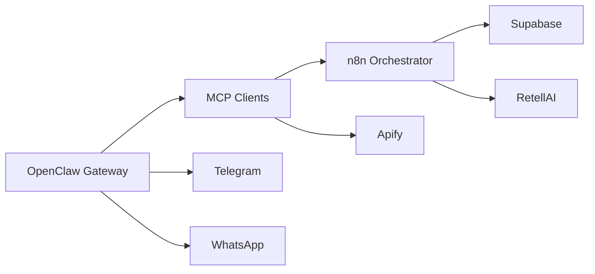

# OpenClaw Elijah_EveBot Architecture

## System Overview

## Protocol Omega v4.0 (Phases 0-4)

1. **Triage**: RiskClass C/B/A
2. **Membrane**: SessionVault (dynamic storage_state/bearer)
3. **Forge**: OpenAPI + test_event replay validation
4. **Lazarus**: Vision fallback via Playwright
5. **Triad**: Class A consensus + ledger (JSONL)

## Lead-Gen Data Flow

1) Telegram trigger -> OpenClaw -> n8n webhook  
2) n8n runs Apify (manual trigger only)  
3) Normalize + dedupe -> Supabase  
4) Retell dispatch (B2B/B2C) -> call_sessions  
5) Retell postcall -> segments + stoplist  
6) Next action routing with guards

## Key Configs

- Runtime config: `/Users/elijah/.openclaw-eve/openclaw.json`
- Secrets: `/Users/elijah/.openclaw_env`
- n8n workflows: `/Users/elijah/Developer/eve-toc-build/workflows_n8n/`
- Supabase schema: `/Users/elijah/Developer/eve-toc-build/supabase/schema.sql`

## Hard Constraints

- **DNC/stoplist**: hard gate before any outreach
- **Call window**: Mon-Sat 09:00-18:00 America/Chicago
- **Idempotency**: `lead_id + date + workflow_id`
- **Max calls/day**: enforced in dispatch workflow
