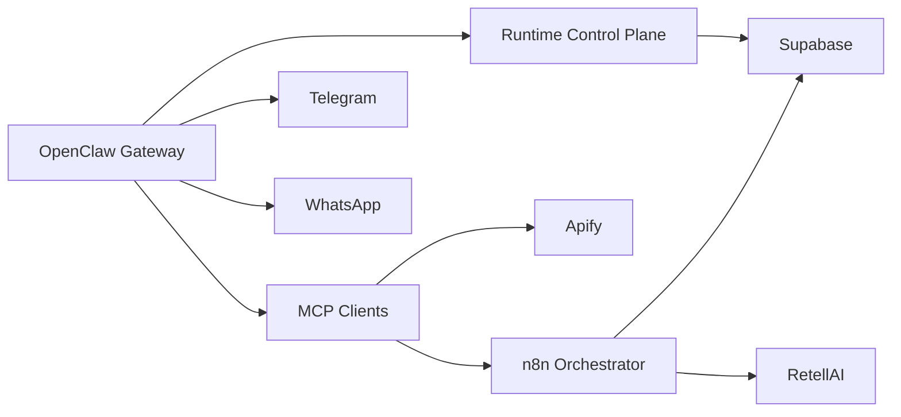

# OpenClaw Elijah_EveBot Architecture

## System Overview

```mermaid
flowchart LR
  OC["OpenClaw Gateway"] --> MCP["MCP Clients"]
  MCP --> N8N["n8n Orchestrator"]
  N8N --> SB["Supabase"]
  N8N --> RT["RetellAI"]
  OC --> TG["Telegram"]
  OC --> WH["WhatsApp"]
  MCP --> AP["Apify"]
  OC --> RTM["Runtime Control Plane"]
  RTM --> SB
```

## Protocol Omega v4.0 (Phases 0-4)

1. **Triage**: RiskClass C/B/A
2. **Membrane**: SessionVault (dynamic storage_state/bearer)
3. **Forge**: OpenAPI + test_event replay validation
4. **Lazarus**: Vision fallback via Playwright
5. **Triad**: Class A consensus + ledger (JSONL)

## Runtime Control Plane (Order-of-Magnitude Upgrade)

- **Model Router**: `src/runtime/model_router.py`
- **Task Engine**: `src/runtime/task_engine.py`
- **Context Store**: `src/runtime/context_store.py`
- **Skill Graph**: `src/runtime/skill_graph.py`
- **Skill Executor**: `src/runtime/skill_executor.py`
- **Telemetry**: `src/runtime/telemetry.py`
- **CLI**: `openclaw_cli.py`

## Lead-Gen Data Flow

1) Telegram trigger -> OpenClaw -> n8n webhook  
2) n8n runs Apify (manual trigger only)  
3) Normalize + dedupe -> Supabase  
4) Retell dispatch (B2B/B2C) -> call_sessions  
5) Retell postcall -> segments + stoplist  
6) Next action routing with guards

## Key Configs

- Runtime config: `${OPENCLAW_STATE_DIR}/openclaw.json`
- Secrets: `${OPENCLAW_ENV_FILE}`
- MCP endpoints configured via environment (e.g., `N8N_MCP_URL`)
- n8n workflows: `${REPO_ROOT}/workflows_n8n/`
- Supabase schema: `${REPO_ROOT}/supabase/schema.sql`
- Supabase runtime upgrade: `${REPO_ROOT}/supabase/upgrade_runtime.sql`

## Hard Constraints

- **DNC/stoplist**: hard gate before any outreach
- **Call window**: Mon-Sat 09:00-18:00 America/Chicago
- **Idempotency**: `lead_id + date + workflow_id`
- **Max calls/day**: enforced in dispatch workflow
