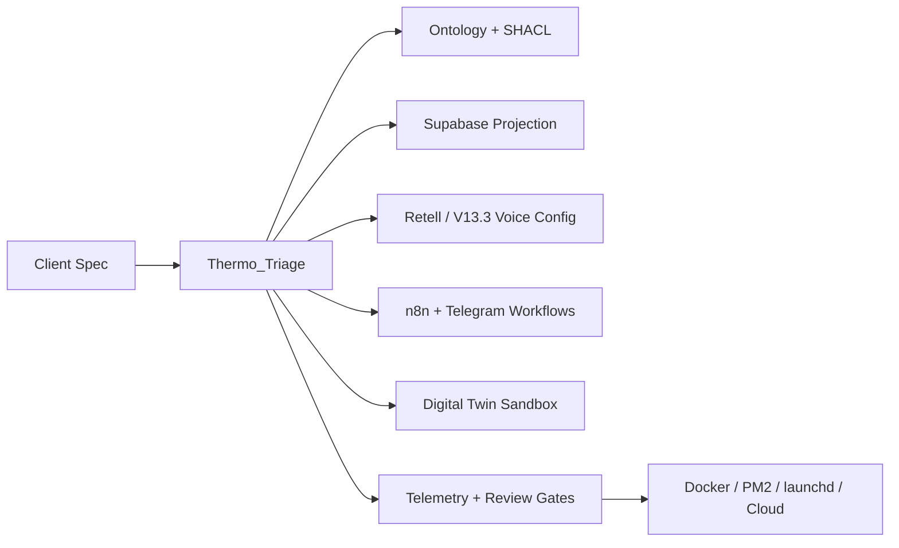

# EVE L5_Medspa_IaC Platform Layer Architecture Extension

## Purpose

This extension turns the current monorepo into a declarative platform compiler:

- input: a Medspa client spec in JSON or parsed natural language
- output: ontology deltas, SHACL shapes, Supabase schema projections, voice-agent configs, n8n workflows, simulator bundles, governance policies, and deploy scaffolding

The design optimizes for:

- `Max_Efficacy`
- `Min_Friction`
- `Bio_Opt`

## First-principles control law

The platform layer treats each Medspa as a constrained flow system:

1. `Thermo_Triage gate`
   - block or slow down high-risk or underspecified specs
   - require minimum viable data for hard-system changes
2. `Shannon entropy bounds`
   - estimate configuration uncertainty across services, staff, personas, locations, and compliance
3. `Pareto frontier`
   - choose interventions that maximize KPI movement per unit friction
4. `LeastAction path`
   - emit the minimum artifact set needed to go from spec -> runnable system
5. `Information Geometry`
   - compare intervention vectors in embedding space to identify redundant or orthogonal capabilities
6. `Complexity reduction`
   - reduce handoffs, branches, duplicate prompts, and manual routing burden

## Declarative source of truth

The new platform source lives in:

- `platform/l5_medspa_iac/specs/`
- `platform/l5_medspa_iac/*.py`

That source then projects into existing monorepo consumption surfaces:

- `ontology/` for ontology extensions + SHACL
- `supabase/` for schema and tenant projection SQL
- `agents/voice-agent/service/orchestration/` for voice orchestration equivalents
- `workflows_n8n/` for workflow JSONs
- `demos/digital-twin/` for simulator inputs
- runtime ops/docs/gates for governance and deployment

## Core compiler stages

### 1. Spec ingestion

- `parse_client_spec()` accepts:
  - JSON dicts
  - `.json` specs
  - natural-language briefs with field heuristics

### 2. Thermo triage + routing

- `run_thermo_triage()` computes:
  - entropy bound
  - leverage score
  - friction score
  - Pareto priority
  - route:
    - `tier_1_routing`
    - `tier_2_routing`
    - `full_matrix_routing`

### 3. Optimization sandbox

- `run_platform_optimization()` constructs a patient-journey graph
- intervention candidates are scored across:
  - conversion
  - retention
  - revenue
  - compliance
- optional scientific stack:
  - `networkx` for graph operations
  - `PuLP` for linear-programming selection
  - `scipy` for vector distance calculations
- deterministic fallbacks remain available when those packages are absent

### 4. Artifact generation

`generate_platform_bundle()` emits:

- `ontology_extension.json`
- `ontology_shapes.ttl`
- `supabase_extension.sql`
- `retell_voice_agent.yaml`
- `n8n_workflow.json`
- `telegram_orchestrator.yaml`
- `digital_twin_simulator.json`
- `governance_manifest.json`
- `docker-compose.yml`
- `ecosystem.config.cjs`
- `launchd.plist`
- `CLOUD_READY.md`

### 5. Governance and acceptance

Each generated bundle carries:

- immutable telemetry requirements
- Elijah_EveBot review-loop hooks
- acceptance gate command references
- red-team voice guardrails
- SHACL validation shapes and schema-safe projections

## Native eve_v2 embedding

The prototype embeds eve_v2 design rules into code, not just prose:

- `Thermo_Triage gate` -> `triage.py`
- `tier_1 / tier_2` routing -> `triage.py`
- `full_matrix_routing` -> `triage.py`
- `leverage scoring` -> `triage.py` + `optimizer.py`
- `Shannon entropy` -> `triage.py`
- `Pareto frontiers` -> `optimizer.py`
- `LeastAction paths` -> `triage.py` + `optimizer.py`
- `Information Geometry for skill embeddings` -> `optimizer.py`
- `Complexity reduction` -> intervention scoring + solver summary

## Generated control-plane topology



## Operator workflow

```bash
python3 scripts/generate_l5_medspa_platform.py \
  --spec-file platform/l5_medspa_iac/specs/radiant_glow_medspa.json \
  --output-dir /tmp/eve-platform \
  --sandbox-only
```

## Why this extension fits the existing monorepo

- It generates into current repo surfaces instead of replacing them.
- It reuses the digital-twin + voice-agent + workflow architecture already present.
- It keeps one authored source-of-truth for Medspa client configuration.
- It converts today’s manually maintained prompt/workflow/schema sprawl into a compiler pipeline.
